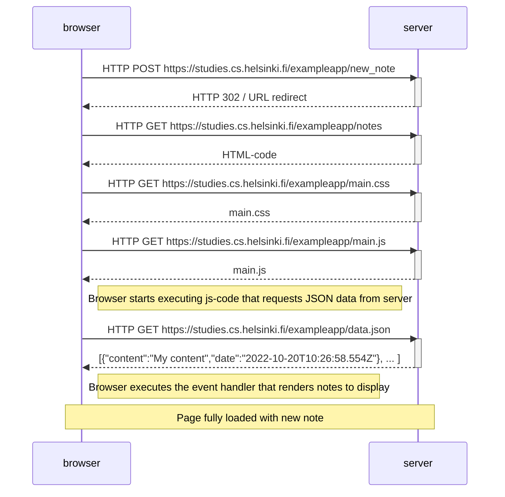

```mermaid
sequenceDiagram
    participant browser
    participant server

    browser->>server:  HTTP POST https://studies.cs.helsinki.fi/exampleapp/new_note
    activate server
    server-->>browser: HTTP 302 / URL redirect
    deactivate server

    browser->>server:  HTTP GET https://studies.cs.helsinki.fi/exampleapp/notes
    activate server
    server-->>browser: HTML-code
    deactivate server

    browser->>server:  HTTP GET https://studies.cs.helsinki.fi/exampleapp/main.css
    activate server
    server-->>browser: main.css
    deactivate server

    browser->>server:  HTTP GET https://studies.cs.helsinki.fi/exampleapp/main.js
    activate server
    server-->>browser: main.js
    deactivate server

    note right of browser: Browser starts executing js-code that requests JSON data from server

    browser->>server:  HTTP GET https://studies.cs.helsinki.fi/exampleapp/data.json
    activate server
    server-->>browser: [{"content":"My content","date":"2022-10-20T10:26:58.554Z"}, ... ]
    deactivate server

    note right of browser: Browser executes the event handler that renders notes to display
    
    note over browser, server: Page fully loaded with new note
```