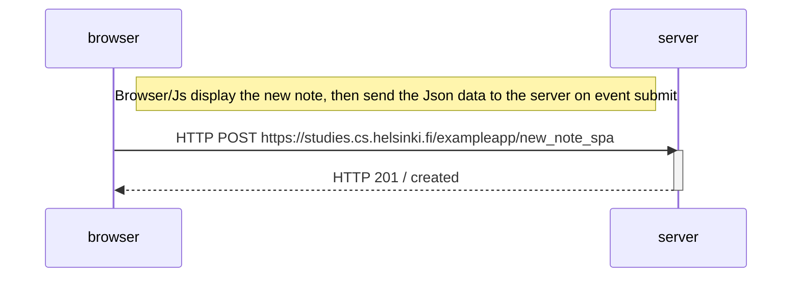

```mermaid
sequenceDiagram
    participant browser
    participant server

    note right of browser: Browser/Js display the new note, then send the Json data to the server on event submit
    browser->>server:  HTTP POST https://studies.cs.helsinki.fi/exampleapp/new_note_spa
    activate server
    server-->>browser: HTTP 201 / created
    deactivate server
    
```